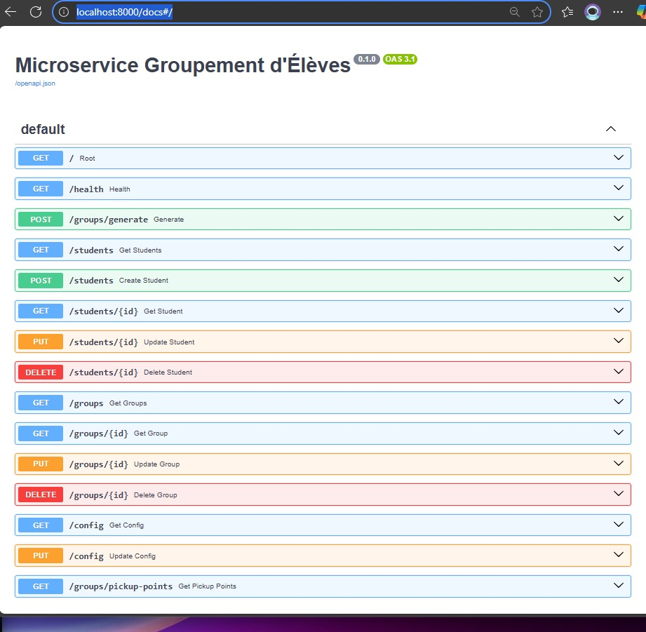
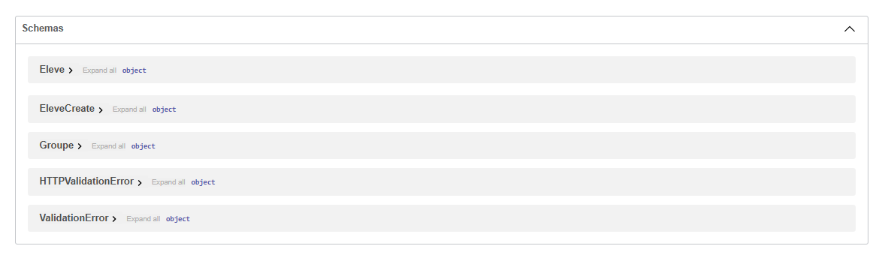

Ce dépôt contient un microservice FastAPI simple pour regrouper des élèves
et calculer des points de ramassage.

## Raccourci — Ce que vous voulez probablement faire
- Démarrer l'API et l'interface Streamlit via Docker Compose
- Ouvrir la documentation interactive OpenAPI (Swagger UI) :
	`http://localhost:8000/docs`

---

## Exécution locale (sans Docker)
1. Créez et activez un environnement virtuel (PowerShell) :

```powershell
python -m venv .venv
.\.venv\Scripts\Activate.ps1
pip install -r requirements.txt
```

2. Lancer l'API (uvicorn) :

```powershell
uvicorn main:app --reload --host 127.0.0.1 --port 8000
```

3. Ouvrir la documentation :

```
http://localhost:8000/docs
```

---

## Exécution avec Docker Compose (recommandé)
1. Construire et démarrer les services :

```powershell
docker compose build --no-cache streamlit app
docker compose up -d --force-recreate app streamlit
```

2. Vérifier l'état et les logs :

```powershell
docker compose ps
docker compose logs -f app --tail 200
docker compose logs -f streamlit --tail 200
```

3. Points utiles :
- L'API est exposée sur le port `8000` du host.
- L'UI Streamlit est exposée sur le port `8501` du host.

---

## Documentation OpenAPI / Swagger
- Swagger UI (interface interactive) : `http://localhost:8000/docs`
- Schéma OpenAPI (JSON) : `http://localhost:8000/openapi.json`

Exemple pour récupérer le schéma depuis la ligne de commande :

```powershell
curl http://localhost:8000/openapi.json -o openapi.json
```


<!-- Two-part screenshot displayed side-by-side -->
<table>
	<tr>
		<td></td>
		<td></td>
	</tr>
</table>

Place your two image files in the project `./screenshot/` folder so they render in the README. If your images are
located at `C:\Users\MSI\Desktop\regroupement-eleve-api-master\screenshot\mecroservice_image2.png` (or similar), use these
PowerShell commands to create the folder and copy/rename the files into place:

```powershell
New-Item -ItemType Directory -Force -Path .\screenshot
# copy the PNG (existing file) as-is
Copy-Item 'C:\Users\MSI\Desktop\regroupement-eleve-api-master\screenshot\mecroservice_image2.png' .\screenshot\mecroservice_image2.png
# if you have a JPG half, copy it as well (adjust the source path if needed)
Copy-Item 'C:\Users\MSI\Desktop\regroupement-eleve-api-master\screenshot\mecroservice_image.jpg' .\screenshot\mecroservice_image.jpg -ErrorAction SilentlyContinue

# If you only have one file and want two halves with the same image, you can duplicate it:
Copy-Item .\screenshot\mecroservice_image2.png .\screenshot\mecroservice_image.jpg -Force
```

The last command duplicates `mecroservice_image2.png` to `mecroservice_image.jpg` so both panels display the same image split across two files.
---

## Tests rapides et vérifications

Depuis l'hôte (PowerShell) :

```powershell
# page d'accueil
Invoke-WebRequest -UseBasicParsing http://localhost:8000/ | Select-Object -Expand Content
# health endpoint
Invoke-WebRequest -UseBasicParsing http://localhost:8000/health | Select-Object -Expand Content
```

Depuis le conteneur Streamlit (si vous avez démarré via Compose) :

```powershell
docker compose exec streamlit curl -sS http://app:8000/health
docker compose exec streamlit curl -sS http://app:8000/
```

---

## Remarques
- Si `docker compose` renvoie une erreur liée au `docker context` (pipe error), exécutez :

```powershell
docker context ls
docker context use desktop-linux   # ou le nom de contexte local affiché
```

- Le service FastAPI fournit les endpoints principaux : `/groups`, `/students`, `/groups/generate`, `/groups/pickup-points`, etc.

Si vous voulez que j'ajoute automatiquement une capture d'écran (fichier `docs_screenshot.png`) ou que je pinne
les versions dans `requirements.txt`, dites-moi et je ferai les modifications.

### Persistance de la base de données

- Le fichier SQLite utilisé par l'application est `groupement.db` et est monté dans le conteneur via la ligne
	`- ./groupement.db:/app/groupement.db` dans `docker-compose.yml`.
- Ce montage signifie que les données sont persistées sur la machine hôte (dans le fichier `groupement.db` à la racine du projet).
- Pour sauvegarder la base avant une opération destructrice :

```powershell
# sauvegarde simple
Copy-Item .\groupement.db .\groupement.db.bak
```

- Pour réinitialiser la base (effacer toutes les données) :

```powershell
# arrêter les conteneurs puis supprimer le fichier DB
docker compose down
Remove-Item .\groupement.db
```

- Après suppression, redémarrez les services (`docker compose up -d`) et la base sera recréée à partir des données d'initialisation (si `init_data` est présent).

Note: sous Windows assurez-vous que le fichier `groupement.db` n'est pas ouvert par une autre application pendant que Docker tente d'y accéder.
